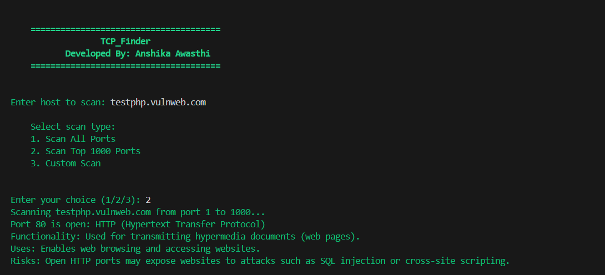

# TCP_Finder

TCP_Finder is a powerful and user-friendly TCP port scanner designed to provide detailed insights into open ports on a target host. Developed by Anshika Awasthi, this tool is perfect for network administrators, security professionals, and anyone interested in exploring network configurations.

## Features

- **Scan All Ports**: Comprehensive scanning of all 65535 TCP ports.
- **Top 1000 Ports Scan**: Quick scan of the top 1000 most common TCP ports.
- **Custom Port Range Scan**: Flexibility to scan a user-defined range of ports.
- **Detailed Port Information**: Provides detailed information about the open ports, including their functionality, uses, and potential risks.
- **Multi-threaded Scanning**: Fast and efficient scanning using multi-threading.
- **Color-coded Output**: Easy-to-read, color-coded terminal output.

## SWOT Analysis

### Strengths
- **User-Friendly Interface**: Intuitive and easy-to-use terminal interface with color-coded output.
- **Detailed Port Information**: Provides comprehensive details about each open port, including potential risks.
- **Customizable Scans**: Ability to scan all ports, top 1000 ports, or a custom range.
- **Efficient Scanning**: Multi-threaded approach ensures quick and efficient scans.

### Weaknesses
- **Limited to TCP**: Only scans TCP ports, not UDP ports.
- **Requires Python**: Needs Python and dependencies to be installed on the system.

### Opportunities
- **Expand Protocol Support**: Adding support for UDP port scanning.
- **Enhanced Reporting**: Generate detailed scan reports in various formats (PDF, HTML, etc.).
- **Integration with Security Tools**: Integrate with other network security tools for comprehensive analysis.

### Threats
- **Competitive Tools**: Other established network scanning tools in the market.
- **Security Concerns**: Potential misuse of the tool for unauthorized scanning.

## Perks of Using TCP_Finder
- **Detailed Insights**: Unlike many other TCP scanners, TCP_Finder provides detailed information about the functionality, uses, and risks associated with each open port.
- **Ease of Use**: The color-coded, user-friendly interface makes it accessible even to those with limited technical knowledge.
- **Flexibility**: Offers multiple scanning options to suit different needs and preferences.
- **Efficiency**: Multi-threaded scanning ensures that even large ranges of ports are scanned quickly and efficiently.

